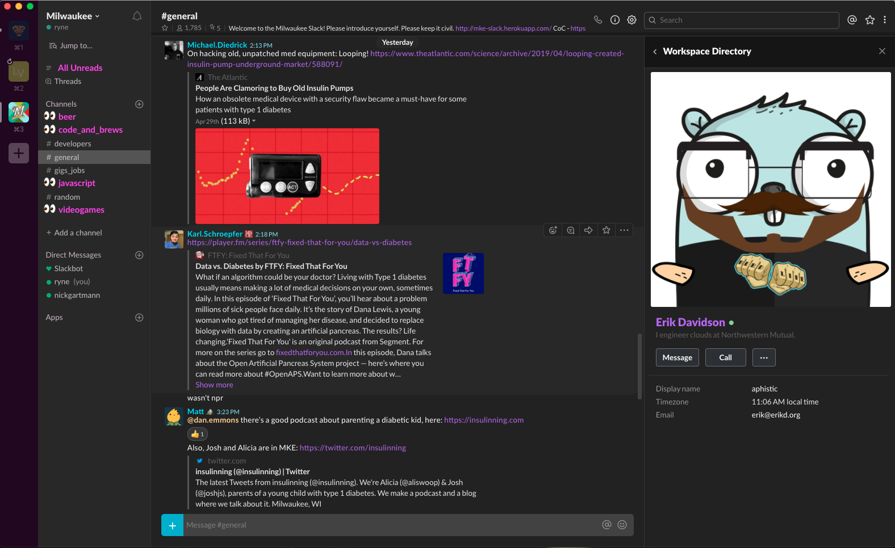
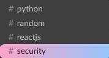

# Slack Dark Theme
inspired by [panda syntax](https://github.com/PandaTheme)

# Theme Preview


# Customization

For any further customizations, you can throw your own css in the `ssb-interop.js` file in the `customCSS` variable provided

Or, if you'd like to tweak the color scheme, the majority of colors have been made into variables in the custom section of the `ssb-interop.js` file so simply change them to your liking:

```css
:root {
    /* Modify these to change your theme colors: */
    --text: #dadada;
    --bg-main: #222;
    --bg-sidebar: #2c2c2c;
    --bg-med: #363636;
    --bg-light: #424242;
    --bg-highlight: #545454;
    --panda-red: #ff2c6d;
    --panda-blue: #72c3ff;
    --panda-teal: #35ffdc;
    --panda-pink: #ff95bf;
    --panda-orange: #ffb86c;
    --panda-purple: #b080f6;
}
```


If you'd like to replace the 👀 with the default unread behavior, put the following in the custom css section of your `ssb-interop.js` file.

```css
.p-channel_sidebar__channel--unread::before{
    color: var(--panda-pink) !important;
    content: '' !important;
    background: var(--panda-pink);
    width: 8px;
    height: 8px;
    border-radius: 50%
}
```

Another helpful tip for customization is being able to run slack in dev mode so that you can inspect the elements. You can use the following command to run slack in dev mode (Mac):

```sh
export SLACK_DEVELOPER_MENU=true && open -a /Applications/Slack.app
```

<hr>

# BLOW IT UP
If you want to get really crazy with the hover effects in the sidebar, try throwing this in the custom css section of your `ssb-interop.js` file:




```css
.p-channel_sidebar__channel:hover::before {
    animation: explode 0.5s cubic-bezier(.87,.25,1,.66) forwards;
    opacity: 1 !important;
    width: 22px;
    font-size: 15px;
}

.p-channel_sidebar__channel:hover span, .p-channel_sidebar__link:hover span {
    color: black !important;
    animation: shake 0.5s linear infinite;
    animation-delay: 0.425s;
}

@keyframes shake {
    0% { transform: translate(1px, 1px) rotate(0deg); }
    10% { transform: translate(-1px, -2px) rotate(-1deg); }
    20% { transform: translate(-3px, 0px) rotate(1deg); }
    30% { transform: translate(3px, 2px) rotate(0deg); }
    40% { transform: translate(1px, -1px) rotate(1deg); }
    50% { transform: translate(-1px, 2px) rotate(-1deg); }
    60% { transform: translate(-3px, 1px) rotate(0deg); }
    70% { transform: translate(3px, 1px) rotate(-1deg); }
    80% { transform: translate(-1px, -1px) rotate(1deg); }
    90% { transform: translate(1px, 2px) rotate(0deg); }
    100% { transform: translate(1px, -2px) rotate(-1deg); }
}

@keyframes explode {
    0% {
        transform: scale(-0.5, 0.5) translate(6px, 1.5px);
        content: '💣';
    }
    85% {
        transform: scale(-1.775, 1.775) translate(6px, 1.5px);
        content: '💥';
    }
    100% {
        transform: scale(-2, 2) translate(6px, 1.5px);
        content: '💥';
    }
}
```

# INSTALL:

**Download and INSTALL this font family**
https://www.fontsquirrel.com/fonts/lato


### Quick Install (MAC)

just run this command to automatically replace the interop file with the one from this repo

```bash
sudo rm -f /Applications/Slack.app/Contents/Resources/app.asar.unpacked/src/static/ssb-interop.js && sudo curl -o /Applications/Slack.app/Contents/Resources/app.asar.unpacked/src/static/ssb-interop.js https://raw.githubusercontent.com/RPuffer/slack-dark-theme/master/ssb-interop.js
```
OR

you can replace the `ssb-interop.js` file manually - the file should be located at:

- Windows: `%homepath%\AppData\Local\slack\resources\app.asar.unpacked\src\static\`
- Mac: `/Applications/Slack.app/Contents/Resources/app.asar.unpacked/src/static/`
- Linux: `/usr/lib/slack/resources/app.asar.unpacked/src/static/`

Windows / Linux paths may be slightly different? The Mac path should be accurate though.

## Then

Restart Slack & ENJOY !!! 🙌🏻

## Uninstall

To remove the dark mode theme, simply delete everything after `line 99` in the `ssb-interop.js` file

---

_PS this is my own customization of another [customization](https://github.com/caiceA/slack-black-theme) of the [original theme](https://github.com/widget-/slack-black-theme)_

TCLCCLE