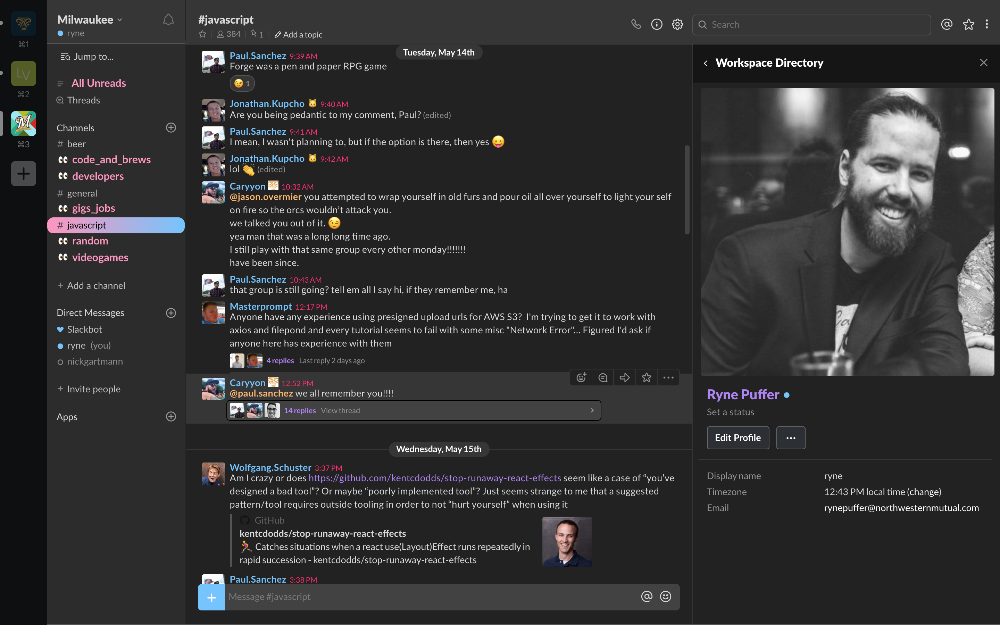

# Slack Dark Theme
inspired by [panda syntax](https://github.com/PandaTheme)

# Theme Preview


# Customization

For any further customizations, you can throw your own css in the `ssb-interop.js` file in the `customCSS` variable provided


If you'd like to replace the eyes with the default unread behavior, put the following in the custom css section of your `ssb-interop.js` file.

```css
  .p-channel_sidebar__channel--unread::before{
    color: var(--panda-pink) !important;
    content: '' !important;
    background: var(--panda-pink);
    width: 8px;
    height: 8px;
    border-radius: 50%
  }
```

Another helpful tip for customization is being able to run slack in dev mode so that you can inspect the elements. You can use the following command to run slack in dev mode (Mac):

```sh
export SLACK_DEVELOPER_MENU=true && open -a /Applications/Slack.app
```

<hr>

# BLOW IT UP
If you want to get really crazy with the hover effects in the sidebar, try throwing this in the custom css section of your `ssb-interop.js` file:


```css
    .p-channel_sidebar__channel:hover::before {
        animation: explode 0.5s cubic-bezier(.87,.25,1,.66) forwards;
        opacity: 1 !important;
        width: 22px;
        font-size: 15px;
    }

    .p-channel_sidebar__channel:hover span, .p-channel_sidebar__link:hover span {
        color: black !important;
        animation: shake 0.5s linear infinite;
        animation-delay: 0.425s;
    }

    @keyframes shake {
        0% { transform: translate(1px, 1px) rotate(0deg); }
        10% { transform: translate(-1px, -2px) rotate(-1deg); }
        20% { transform: translate(-3px, 0px) rotate(1deg); }
        30% { transform: translate(3px, 2px) rotate(0deg); }
        40% { transform: translate(1px, -1px) rotate(1deg); }
        50% { transform: translate(-1px, 2px) rotate(-1deg); }
        60% { transform: translate(-3px, 1px) rotate(0deg); }
        70% { transform: translate(3px, 1px) rotate(-1deg); }
        80% { transform: translate(-1px, -1px) rotate(1deg); }
        90% { transform: translate(1px, 2px) rotate(0deg); }
        100% { transform: translate(1px, -2px) rotate(-1deg); }
    }

    @keyframes explode {
        0% {
            transform: scale(-0.5, 0.5) translate(6px, 1.5px);
            content: '💣';
        }
        85% {
            transform: scale(-1.775, 1.775) translate(6px, 1.5px);
            content: '💥';
        }
        100% {
            transform: scale(-2, 2) translate(6px, 1.5px);
            content: '💥';
        }
    }
```

## First:

**Download and INSTALL this font family**
https://www.fontsquirrel.com/fonts/lato


## Second:

### Quick Install

just run this command to automatically replace the interop file with the one from this repo

```bash
sudo rm -f /Applications/Slack.app/Contents/Resources/app.asar.unpacked/src/static/ssb-interop.js && sudo curl -o /Applications/Slack.app/Contents/Resources/app.asar.unpacked/src/static/ssb-interop.js https://raw.githubusercontent.com/RPuffer/slack-dark-theme/master/ssb-interop.js
```

OR

Replace your CURRENT **ssb-interop.js** File
Located at `/Applications/Slack.app/Contents/Resources/app.asar.unpacked/src/static/`

#### With this

[ssb-interop.js file in this repo](https://github.com/RPuffer/slack-dark-theme/blob/master/ssb-interop.js)

## Third

Restart Slack & ENJOY !!! 🙌🏻

## Other

Updating Slack will not cause this theme to reset! 🦁


---

_PS this is my own customization of another [customization](https://github.com/caiceA/slack-black-theme) of the [original theme](https://github.com/widget-/slack-black-theme)_
